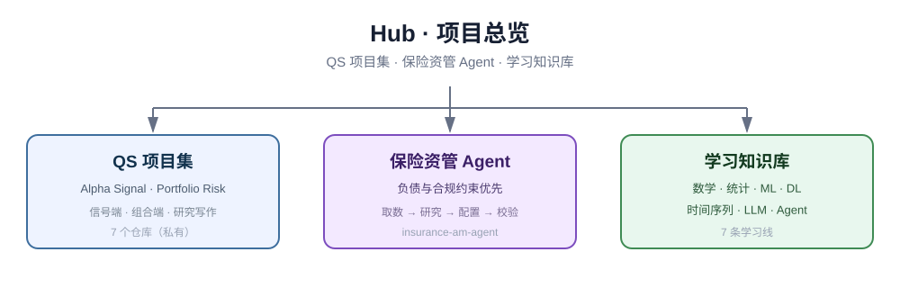
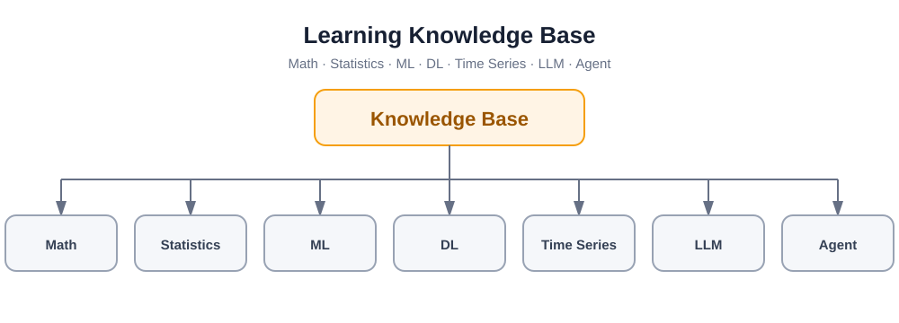

# 🗂️ Hub

**项目与知识库的总入口**

QS 项目集 · 保险资管 Agent · 学习知识库

---

这个仓库只做三件事：说明各部分之间的关系、给出入口链接、放框架图与时序图。
具体的代码、笔记和报告都在各自的仓库里，这里不重复内容。

## 总体结构

## 1 · QS 项目集

量化策略与组合研究的主线，分成信号端与组合端两段。

| 端 | 回答的问题 | 代表仓库 |
| --- | --- | --- |
| 信号端 | 什么样的数据能变成可回测的信号 | `Alpha-Signal-Research` · `qs-alpha-research-workbench` · `llm-alt-data-alpha` |
| 组合端 | 信号如何变成可交付的组合 | `portfolio-optimization` · `multi-asset-allocation` · `quant-portfolio-writeups` |

> 以上仓库目前为**私有**，仅本人可见。

### 项目框架图

### QS 工作流时序图

[查看 QS 项目框架与时序图清单](./QS_QA_%E5%B7%A5%E4%BD%9C%E6%B5%81%E6%97%B6%E5%BA%8F%E5%9B%BE_%E5%BA%94%E6%9C%89%E9%A1%B9%E7%9B%AE%E6%B8%85%E5%8D%95.md)

## 2 · 保险资管 Agent

面向保险资管场景的 Agent 集合：不追行情、不做自动下单，把「取数 → 研究 → 配置 → 合规校验 → 出报告」这条链路自动化，最终产出带签批与留痕的决策建议。

- [`insurance-am-agent`](https://github.com/Aayloo/insurance-am-agent)
  多 Agent 保险资管框架。结构上像 TradingAgents 那样由一组研究员 Agent 协作，但**起点是负债与监管约束，终点是决策建议而不是交易单**。Python，v0.1 可运行。

后续新增的行业 Agent 会继续归到这一栏。

## 3 · 学习知识库

只保留学习框架与知识产出流程，不展开具体 Notebook 与课程内容。每条线对应一个仓库。

| 学习线 | 仓库 |
| --- | --- |
| 数学基础 | [`math-foundation`](https://github.com/Aayloo/math-foundation) |
| 统计 | [`statistics-for-qs`](https://github.com/Aayloo/statistics-for-qs) |
| 机器学习 | [`ML`](https://github.com/Aayloo/ML) |
| 深度学习 | `deep-learning-notes`（私有） |
| 时间序列 | `time-series-notes`（私有） |
| 大语言模型 | [`LLM`](https://github.com/Aayloo/LLM) |
| AI Agent | [`Agent`](https://github.com/Aayloo/Agent) |

### 知识库框架图

### 知识库产出时序图

## 许可证

MIT © 2026（本仓库仅包含说明文档与图，内容仓库各自独立）
